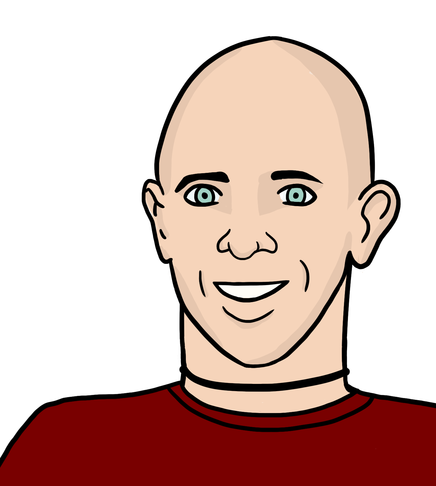
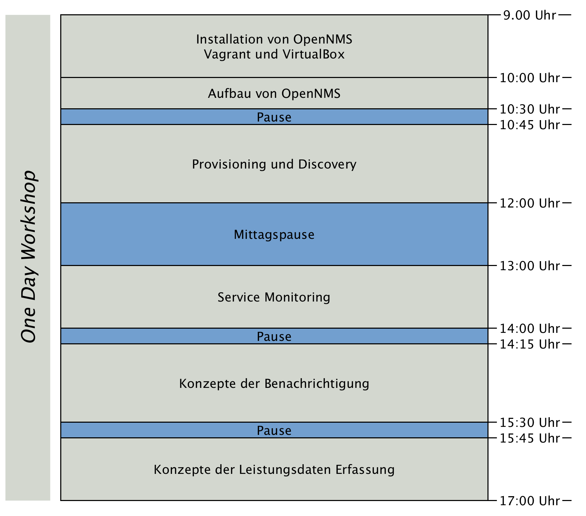

// Introduction
== /whois

*Name:*

- Ronny Trommer
- `_indigo`
- Workshop powered by: link:http://www.buero20.org[Büro 2.0] - Open Source Co-Working & Expert Network in Berlin

*Zeitvertreib:*

- Monitoring und Netzwerkmanagement mit freier Software seit 2005
- Co-Author link:http://www.dpunkt.de/buecher/3194.html[OpenNMS Netzwerkmanagement mit freier Software]
- Co-Founder link:http://www.opennms.eu[OpenNMS Foundation Europe e.V.]
- Loves to contribute stuff under free licenses
- GSoC Mentor for the OpenNMS project in 2010/2011/2012
- Freifunk Fulda | http://www.freifunk-fulda.de
- Chaostreff Fulda irc://irc.hackint.org: `#mag.lab` | http://mag.lab

*Contact:*

- OpenNMS channel irc://irc.freenode.org: `#opennms` | http://www.opennms.org
- mailto: ronny@opennms.org

== Material

- Slides online: http://www.opennms.eu/slides/buero20/workshop.html
- GitHub: https://github.com/opennms-forge/buero2.0-workshop
- Download VirtualBox: https://www.virtualbox.org/wiki/Downloads
- Download Vagrant: https://www.vagrantup.com/downloads.html

== Agenda

- How to install link://www.opennms.org[OpenNMS]?
- What are the components of OpenNMS?
- How to provision and discover nodes and services?
- How to monitor a service?
- How to configure notifications for service or node outages?
- How to collect performance data?

<<<

