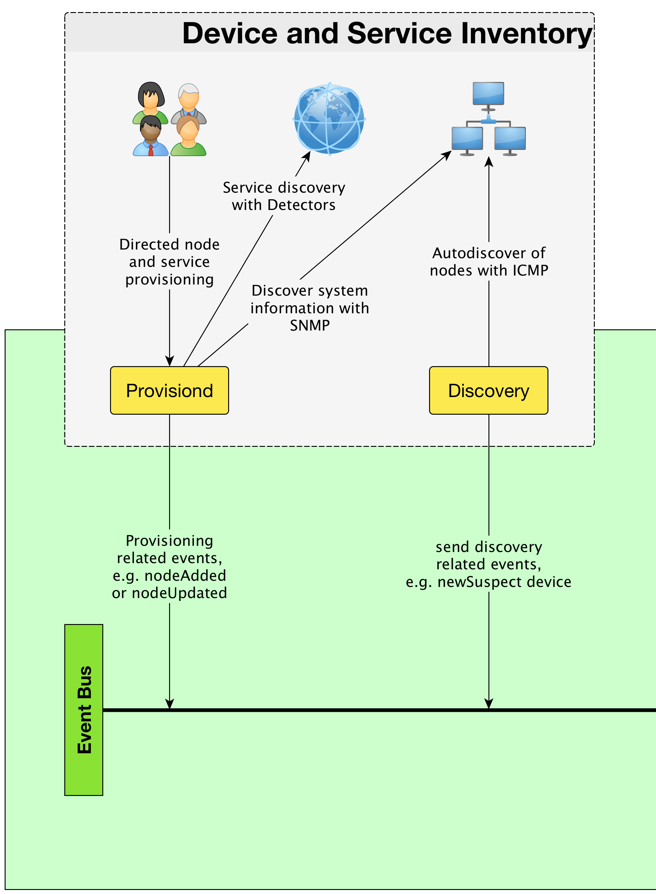
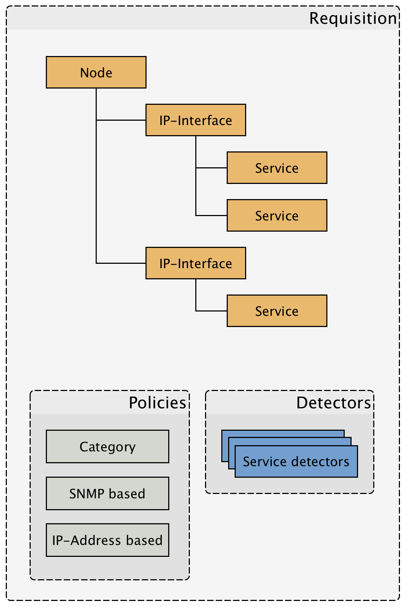

== How to provision and discover nodes and services?

<<<

* Provisiond enriches nodes with SNMP information
** The system object ID is used to classify nodes
** Gather network interfaces, e.g. eth0
** Gather IPv4 and IPv6 IP Addresses

* Provisiond can detect services with _Detectors_
** Layer 3, ICMP, StrafePing
** Layer 4 TCP ports
** Layer 5+, Application like HTTP, SMTP, IMAP, SQL, etc.
** Services for management protocols, e.g. is the BIOS status over WMI available or is possible to test the status of Fans in a switch.

* Provisiond allows grouping of nodes in _Requisitions_
* _Requisitions_ allow to build monitoring profiles, e.g. Mail server with detectors for SMTP
* Monitoring profile for web server with detectors for HTTP
* _Policies_ can be assigned to _Requisitions_, z.B. sort Nodes based on rules into categories
* Configuration: `provisiond-configuration.xml`, `imports/` adn `foreign-sources/`
* _SNMP communities_ are system wide per IP-Address configures, e.g. _Provisiond_, _Pollerd_, SNMP-Traps, _Collectd_

<<<

<<<

* _Discovery_ is a daemon who scans IP spaces
* Every respond based on ICMP is forwarded in a event to _Provisiond_ for further investigation
* _Provisiond_ investigates new suspect IP adresses with detectors and SNMP
* It is possible to set `foreign-source=MyNetworkName` to a specific IP range to organize discovered nodes in a _Requisition_
* IP ranges for _Discovery_ daemon are configured in `discovery-configuration.xml`

== Practice in our playground

* Create some nodes, e.g. www.google.com, local OpenNMS Linux System
* Configure SNMP on the Linux system
* Use SNMP community in OpenNMS and create requisition for the new node
* Investigate detectors and try a _Set Node Category_
* Try to discover IP addresses with _Discovery_ and put them in a _Requisition_
