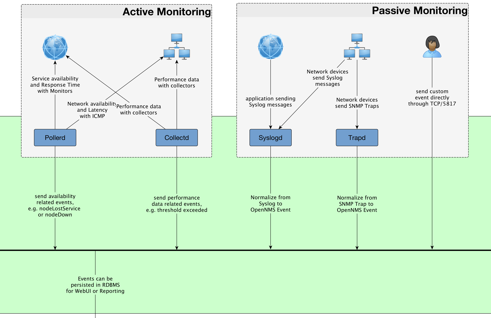
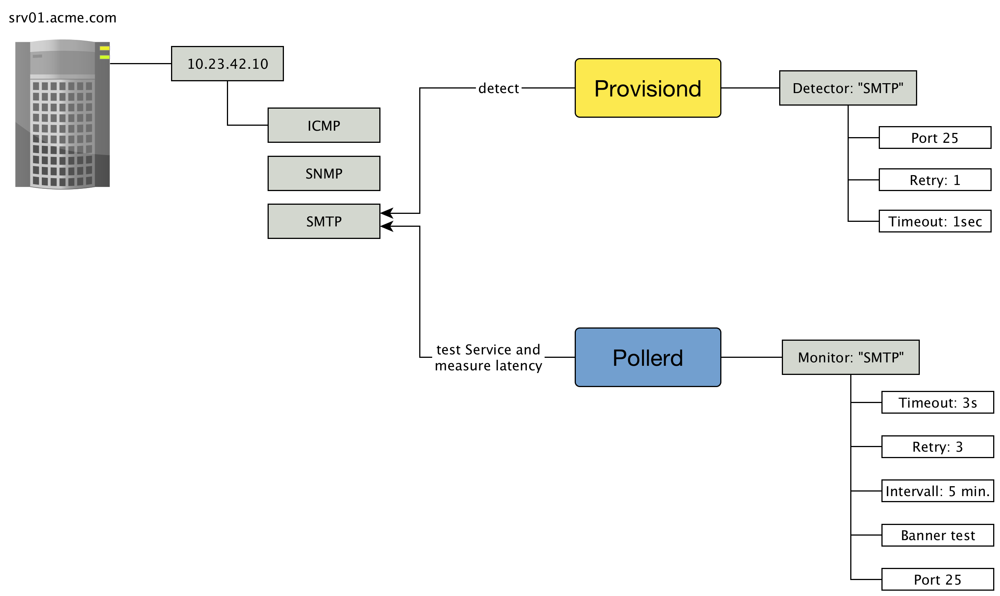
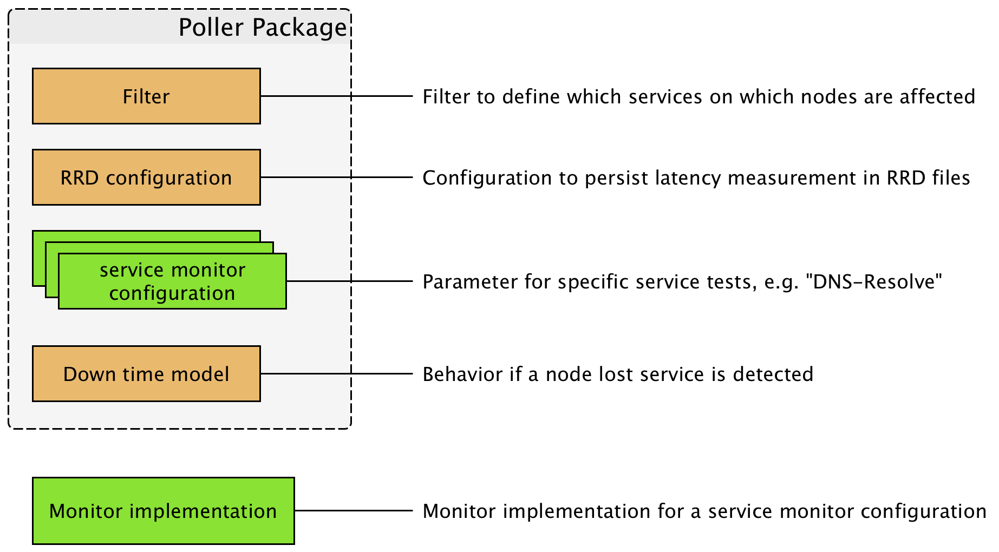

== How to monitor a service?

* OpenNMS distinct services to detect a service and to monitor a service
* _Provisiond_ has detectors to get services into monitoring on a specific IP interface
* _Pollerd_ is the component who runs the test, document availability and measures response time
* Configuration for _Pollerd_ is in `poller-configuration.xml`
* The shared knowledge between _Provisiond_ and _Pollerd_ is the `service-name`
* link:http://docs.opennms.org/OpenNMS/snapshot/develop/documentation/guide-admin/[Monitor documentation]
* link:http://www.opennms.org/wiki/Page_Sequence_Monitor_%28PSM%29_Setup[Page Sequence Monitor]

== Components specific for monitoring in OpenNMS

== Provisioning and Pollerd

== How to monitor a service?

.Configuration file structure

== Configure some services for Web monitoring in our playground
* DNS Resolution
* Test availability of a Web-Seiten
* Keywords: HTTP Monitor, DNS Resolution Monitor, Page Sequence Monitor
