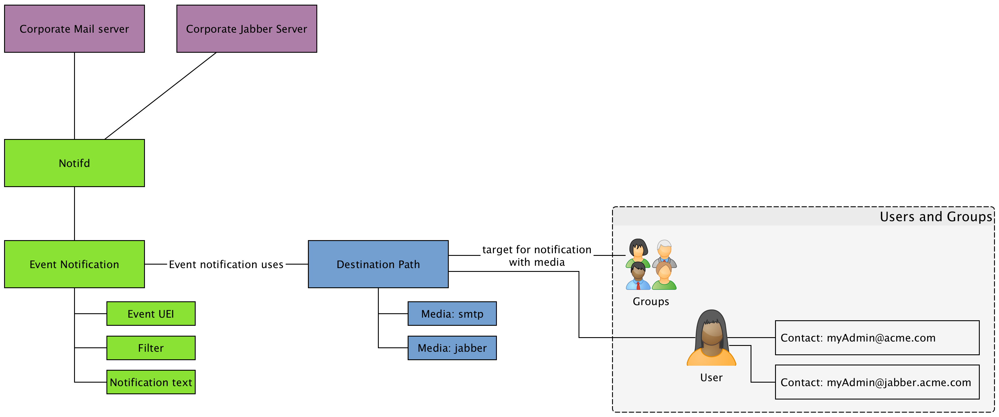

== How to configure notifications for service or node outages?

.Overview about notifications

<<<

* Mailserver to send SMTP notifications `javamail-configuration.properties`
* Jabber to send XMPP notifications `xmpp-configuration.properties`
* User have mail address or jabber address
* Notification is by default *OFF*
* Test some notifications and change notification text messages
* Test with `send-event.pl` or set a blackhole route of an IP and make it unavailable

.Test with `send-event.pl`
[source,bash]
----
cd /usr/share/opennms/bin
./send-event.pl -i 127.0.0.1 uei.opennms.org/nodes/nodeLostService -s ICMP -n {nodeid}
----

.Test der Benachrichtigung mit blackhole route
[source,bash]
----
ip route add {ipaddress}/32 via 127.0.0.1
----

Show prepared mail server configuration with accounts