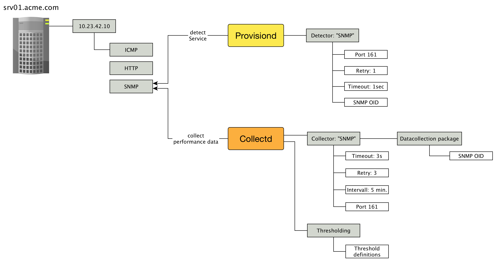

== How to collect performance data?

* Where to get performance metrics
* What protocol – SNMP, WMI, JMX, JDBC, HTTP
* Which metrics should be collected
* _Collectd_ uses a service name
* _Collectd_ is all about creating RRD files - nothing else!
* Viewing performance graph reports in the WebUI is something else
* _Collectd_ evaluates thresholds

<<<

.Interaction between services and collecting performance data

<<<

.Protocol configuration to gather performance metrics

<<<

[source, bash]
----
root@vagrant:/usr/share/opennms/share/rrd# tree -L 2
.
├── response
│   ├── 127.0.0.1
│   ├── 192.168.2.1
│   ├── 192.168.2.117
│   └── 192.168.2.184
└── snmp
    ├── 2 <-- a lot of RRD files for this node, interfaces, hard disks, CPU etc.
    ├── 3
    ├── 5
    └── 6
----

<<<

* WebUI renders RRD graph files as PNG on demand
* Graph reports define how the metrics should be presented, e.g. calculation, aggregation, line charts, stacked etc.
* Performance graph reports are built with RRD graph commands
* Graph reports can be found in `snmp-graph.properties.d` and `response-graph.properties`
