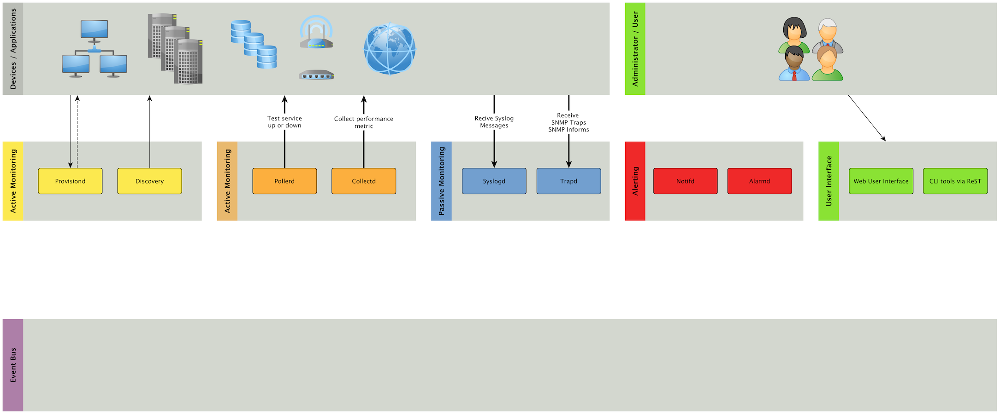

:icons: font
:backend: deckjs
:deckjs_theme: indigo
:deckjs_transition: fade
:navigation:
:status:
:split:
:goto:
:menu:

= OpenNMS Workshop

image::images/cc-by4.0.png[float="right",link="http://creativecommons.org/licenses/by/4.0/"]

== /whois

image::images/ronny_right.png[225px, 225px, float="right", link="http://www.open-factory.org"]

*Name:*

- Ronny Trommer
- `_indigo`

*Stuff:*

- Monitoring und Netzwerkmanagement mit freier Software seit 2005
- Co-Author link:http://www.dpunkt.de/buecher/3194.html[OpenNMS Netzwerkmanagement mit freier Software]
- Co-Founder link:http://www.opennms.eu[OpenNMS Foundation Europe e.V.]
- Loves to contribute stuff under free licenses
- GSoC Mentor im OpenNMS Projekt 2010/2011/2012

*Contact:*

- OpenNMS channel irc://irc.freenode.org: `#opennms`
- Chaostreff Fulda irc://irc.hackint.org: `#mag.lab`
- mailto: ronny [äth] opennms.org

== Material

- Slides online: http://www.opennms.eu/slides/buero20/workshop.html
- GitHub: https://github.com/opennms-forge/buero2.0-workshop
- Download VirtualBox: https://www.virtualbox.org/wiki/Downloads
- Download Vagrant: https://www.vagrantup.com/downloads.html

== Agenda

- Wie installiert man link://www.opennms.org[OpenNMS] und was hat es mit link:https://vagrantup.com[Vagrant] und link:https://www.virtualbox.org[Virtualbox] auf sich?
- Wie ist OpenNMS aufgebaut?
- Wie kommen Geräte und Dienste in OpenNMS?
- Wie kann ich Tests für Dienste konfigurieren?
- Wie richtet man eine Benachrichtigungen ein?
- Wie werden Leistungsdaten erfasst?

<<<

image:images/buero2.0-agenda.png[]

== Wie installiert man OpenNMS?

*Binary packages*

- Linux Distributionen: link:https://www.debian.org/[Debian], link:http://www.ubuntu.com/[Ubuntu], link:http://www.centos.org/[CentOS]
- Datenbank: link:http://www.postgresql.org/[PostreSQL] >9.1
- Java Runtime environment: link:http://openjdk.java.net/[OpenJDK 1.7] oder link:http://www.oracle.com/technetwork/java/javase/downloads/jre8-downloads-2133155.html[Oracle Java 1.7+]
- Leistungsdaten: link:http://www.rrdtool.org[RRDtool] oder link:https://github.com/OpenNMS/jrobin[JRobin]
- OpenNMS Repository und Installationsbeschreibung für link:http://www.opennms.org/wiki/Installation:Debian[APT] und link:http://www.opennms.org/wiki/Installation:Yum[YUM]
- Installationsbeschreibung für OpenNMS auf link:http://wiki.ubuntuusers.de/OpenNMS[ubuntuusers]

*Source Code*

- link:http://openjdk.java.net[OpenJDK] oder link:http://www.oracle.com/technetwork/java/javase/downloads/jdk8-downloads-2133151.html[Oracle Java Development Kit] wird benötigt
- link:http://maven.apache.org/download.cgi[Apache Maven] wird verwendet um Abhängigkeiten zu externen Bibliotheken zu verwalten
- Source code kompilieren und packaging: -> http://www.opennms.org/wiki/Installation:Source

== Installation am Beispiel Ubuntu

*Step 1:* Java Runtime Environment und PostgreSQL installieren

[source,bash]
----
aptitude install openjdk-7-jre-headless
----

NOTE: Alternativ kann das Oracle JRE über externes link:http://www.webupd8.org/2012/09/install-oracle-java-8-in-ubuntu-via-ppa.html[PPA Repository] installiert werden.

.Installation PostgreSQL Datenbank Server
[source,bash]
----
aptitude install postgresql-9.3
----

<<<

*Step 2:* PostgreSQL Datebank vorbereiten

.Wechseln zu Postgres user und OpenNMS Datenbank Benutzer erstellen
[source,bash]
----
root@vagrant:~# su - postgres
postgres@vagrant:~$ createuser opennms
----

.Kennwort für OpenNMS und Postgres user setzen
[source,bash]
----
postgres@vagrant:~$ psql
postgres=# ALTER USER opennms with password 'geheim';
ALTER ROLE
postgres=# ALTER USER postgres with password 'geheim';
ALTER ROLE
postgres=# \q
postgres@vagrant:~$ exit
logout
root@vagrant:~#
----

<<<

*Step 3:* OpenNMS Repository eintragen und OpenNMS installieren

.Source list: `/etc/apt/sources.list.d/opennms.list`
[source,bash]
----
# contents of /etc/apt/sources.list.d/opennms.list
deb http://debian.opennms.org stable main
deb-src http://debian.opennms.org stable main
----

TIP: Für Installationen aus dem europäischen Raum kann `{debian,yum}.opennms.eu` als repository mirror verwendet werden.

.GPG Key installieren
[source,bash]
----
wget -O - http://debian.opennms.org/OPENNMS-GPG-KEY | sudo apt-key add -
----

.Repository aktualisieren
[source,bash]
----
root@vagrant:~# aptitude update
root@vagrant:~# aptitude install opennms
----

<<<

*Step 4:* Java Umgebung für OpenNMS einrichten

[source,bash]
----
root@vagrant:~# cd /usr/share/opennms/bin
root@vagrant:~# ./runjava -s

root@vagrant:~# update-alternatives --list java
/usr/lib/jvm/java-7-openjdk-amd64/jre/bin/java

# Set as JAVA_HOME in /etc/default/opennms
root@vagrant:~# cat /etc/default/opennms
JAVA_HOME=/usr/lib/jvm/java-7-openjdk-amd64/jre/bin/java
----

<<<

*Step 5:* OpenNMS Databankzugriff konfigurieren und Datenbank initialisieren

.Datenbank Authentifizierung konfigurieren in `/etc/opennms/opennms-datasources.xml`
[source,xml]
----
<jdbc-data-source name="opennms"
                  database-name="opennms"
                  class-name="org.postgresql.Driver"
                  url="jdbc:postgresql://localhost:5432/opennms"
                  user-name="opennms"
                  password="geheim" /><1>

  <jdbc-data-source name="opennms-admin"
                  database-name="template1"
                  class-name="org.postgresql.Driver"
                  url="jdbc:postgresql://localhost:5432/template1"
                  user-name="postgres"
                  password="geheim" /><2>
----
<1> OpenNMS Benutzer Kennwort für Zugriff auf die OpenNMS Datenbank
<2> Postgres Benutzer um die Datenbank anzulegen und Schema-Änderungen beim Update durchzuführen

.OpenNMS Datenbankschema installieren
[source,bash]
----
root@vagrant:~# cd /usr/share/opennms/bin
root@vagrant:~# ./install -dis
----

<<<

*Step 6:* OpenNMS starten und Zugriff auf WebUI

[source,bash]
----
root@vagrant:~# service opennms start
----

Browser: http://<ip-adresse>:8980

Login: _admin_ +
Kennwort: _admin_

== Wie ist OpenNMS aufgebaut?

== Wie kommen Geräte und Dienste in OpenNMS?

== Wie kann ich Tests für Dienste konfigurieren?

== Wie richtet man eine Benachrichtigungen ein?

== Wie werden Leistungsdaten erfasst?

